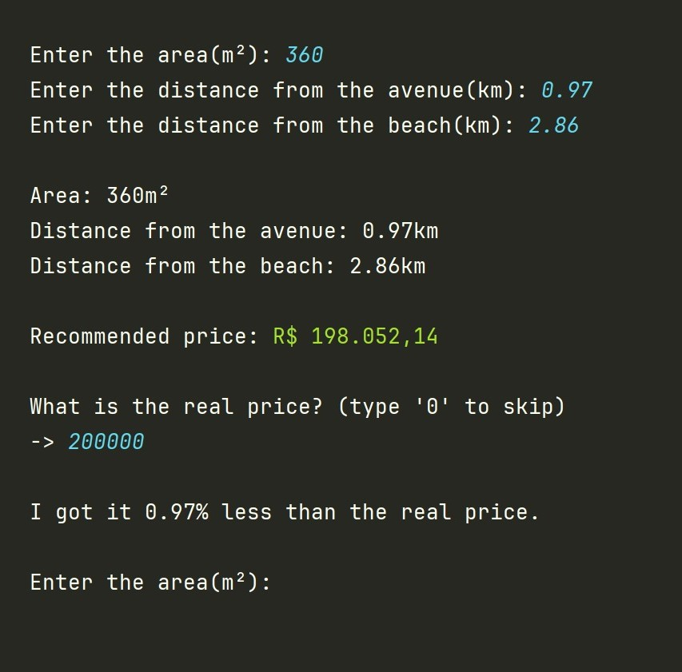

# Fuzzy Land Pricing

<div align="center">
    <p>
        
    </p>
</div>

## Overview
The Land Pricing Project is a Python-based system that utilizes fuzzy logic to estimate land prices. By considering factors such as land area, distance from the avenue, and distance from the beach, the system generates estimated price ranges. Users can input land attributes to receive estimated prices and compare them to real prices for validation.

## Installation

1. Clone the repository:

    ```bash
    git clone https://github.com/gvlk/fuzzy-land-pricing.git
    ```

2. Install the required dependencies:

    ```bash
    pip install -r requirements.txt
    ```

3. Run the main.py file:

    ```bash
    python main.py
    ```

## Usage

1. Run the main.py file.
2. Enter the land attributes when prompted (area, distance from the avenue, distance from the beach).
3. View the estimated price generated by the system.
4. Optionally, input the real price to compare it with the estimated price.


